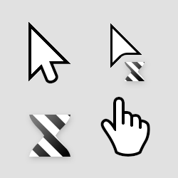

# Posy's Improved Cursors for Linux

This is a Linux port of Michiel de Boer's amazing cursor design.
He presented it in a brilliant video in 2018: [Posy - Mouse Cursor History (and why I made my own)](https://www.youtube.com/watch?v=YThelfB2fvg)

The original work can be found on his website, [michieldb.nl](http://www.michieldb.nl/other/cursors/), as well as installers for Windows.

As the cursor designs were originally made for Windows, they are hard to find for Linux.
Also, keep in mind Linux cursors do not work the same as Windows', therefore you might find some scenarios where the displayed cursor do not seem appropriate. I am aware of this, though, not being the original designer, I cannot do much.
I tried fixing most cases by reusing already existing cursors.
Feel free to leave a comment here and eventually make a PR if you found a weird scenario like this.

> I still encounter weird cursor changes on KDE:
> like now, I'm using Kate with the Posy's default cursor set, but the beam is this weird little ugly one.
> Even though I see Posy's beam in my browser.

## What's in there

I ported the following sets.
Some of them use cursors form the *Extras* set: the black and mono black ones use the black hand and the inverted move cursor.

### Posy's Cursor

### Posy's Cursor Black

### Posy's Cursor Mono

### Posy's Cursor Mono Black

### Posy's Cursor Strokeless

## How to use

If you're on KDE, you can install [my cursor collection](https://www.pling.com/p/1795042/) directly from the settings:

Go to the settings, search for a "cursors" menu in Appearance, click **Obtain new cursor...**, search for "Posy's improved cursor", click **Install...** and select the set you'd like to install.

If you do not want to use the online library, you can download the folders containing the sets you want and add them in the _.icons_ folder in your Home directory (create it if you can't find it).
Then, go to the Cursors menu in the Appearance settings and you should see the themes you imported.

The cursor sets are available in many sizes: 32, 48, 64, 96 and 128 pixels.

> I could not manage to have them in 24px, if you know a way, please tell me.

## How it's done

I admit that I am far from experienced in this, I didn't know how cursors worked or how they are packaged on Linux until yesterday.
So here is my workflow, feel free to criticize it and contribute to make it better.
I am no cursor geek but I have some free time to spare on (not so) useful things 😉

I used [quantum5's win2xcur](https://github.com/quantum5/win2xcur) to convert the original files to X11 cursors.

I then followed [the principle](https://userbase.kde.org/Create_your_own_mouse_cursor_theme) of putting them in a folder with an index.theme at the upper level.

Then, I need to give them real cursor names, so I open a reputable cursor set I found on the Internet, and proceed to gather the common names of cursors, things like: `left_ptr`, `hand`, `double_arrow` or the obvious `9d800788f1b08800ae810202380a0822`.

In order to reduce the size of the packages, when the same cursor must be reused, I create a symbolic link (relative, not absolute) instead of copying it.

Finally, I import it to KDE and test it.

> This is the hard part as it never works as intended because of so many side effects: cache, reboot required, browser internal cursors being use instead, KDE being weird, etc.

When I am satisfied, I duplicate the set and replace the cursor files (not the sym-links) with the ones from a new set.

I now know that I should have scripted this process, but hey.. too late.
